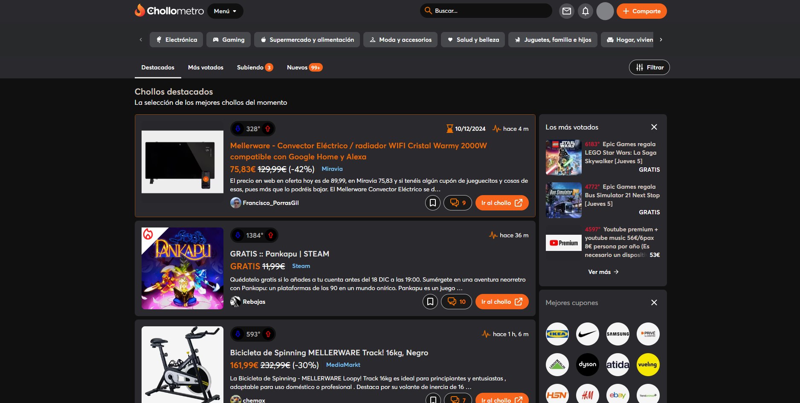

# Chollometro Dark CSS

Este es un estilo CSS personalizado para Chollometro, basado en una versión antigua y mejorado con el tiempo.

## Licencia

Por favor, respeta la licencia de este proyecto. Puedes encontrar más detalles en el archivo `LICENSE`.

## Contribuciones

Estamos abiertos a contribuciones. Si encuentras algún error o tienes alguna sugerencia, por favor, súbelo como un issue en GitHub.

## Mantenedor

Actualmente, soy el único mantenedor de este proyecto.

¡Gracias por tu interés y contribuciones!

## Instalación

Para instalar este estilo CSS personalizado en Chollometro, sigue estos pasos:

1. Descarga el archivo CSS desde el repositorio.
2. Instala la extensión [Stylus](https://add0n.com/stylus.html) en tu navegador o un gestor de estilos CSS compatible.
3. Abre la extensión Stylus y crea un nuevo estilo.
4. Copia y pega el contenido del archivo CSS descargado en el nuevo estilo.
5. Guarda el estilo y asegúrate de que esté habilitado.

También puedes instalar este estilo CSS directamente desde la tienda de estilos de Stylus. Para ello, sigue este enlace: [Chollometro Dark CSS](https://userstyles.world/style/5f7b4b3b7f4b7b001b3f3b3b), pero ten en cuenta que la versión de la tienda puede no estar actualizada.

## Características

Este estilo CSS incluye las siguientes mejoras:

- **Modo Oscuro:** Un tema oscuro que es más fácil para los ojos durante la noche.
- **Mejoras de Legibilidad:** Fuentes y tamaños de texto optimizados para una mejor lectura.
- **Diseño Moderno:** Elementos de interfaz actualizados para un aspecto más moderno y limpio.
- **Compatibilidad:** Probado en las últimas versiones de los navegadores más populares.

## Agradecimientos

Quiero agradecer a todos los que han contribuido a este proyecto, ya sea reportando errores, sugiriendo mejoras o contribuyendo con código. Su apoyo es invaluable y ayuda a que este proyecto siga mejorando.

## Contacto

Si tienes alguna pregunta o necesitas ayuda, no dudes en contactarme a través de GitHub. Estoy aquí para ayudar y mejorar este proyecto con tu colaboración.

¡Gracias por tu apoyo y feliz navegación con Chollometro Dark CSS!
